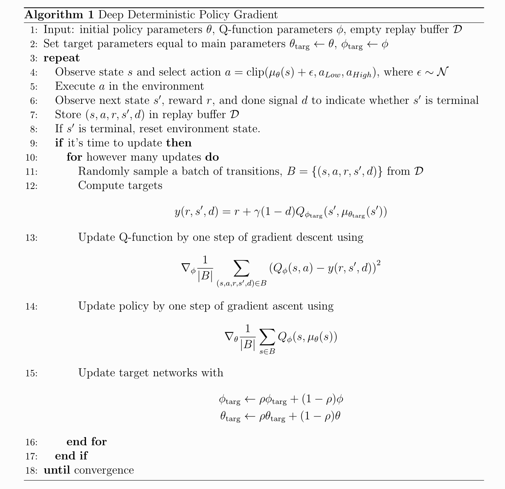

# Deep Deterministic Policy Gradient Algorithm Implementation

I tried to implement the DDPG algorithm presented in the paper _Continuous Control with Deep Reinforcement Learning_ by David Silver et al.

The authors present a method for training RL agents in high-dimensional continuous action spaces. Prior to this work, many RL algorithms could only handle low dimensional and discrete action spaces and we see that many tasks of interest, most notably physical control tasks, have continuous (real valued) and high dimensional action spaces.

In their, the authors present a model-free, off-policy actor-critic algorithm using deep function approximators (neural networks) that can learn policies in high-dimensional, continuous action spaces. Their algorithm is called **Deep Deterministic Policy Gradient**.

They combine the actor-critic approach with insights from the recent success of Deep Q Network (DQN). Prior to DQN, it was generally believed that learning value functions using large, non-linear function approximators was difficult and unstable. DQN is able to learn value functions using such function approximators in a stable and robust way due to two innovations:

1. The network is trained off-policy with samples from a replay buffer to minimize correlations between samples
2. The network is trained with a target Q network to give consistent targets during temporal difference backups.

## Pseudocode of DDPG

## Implementation Details

Note that the values listed below are the ones used by the authors of the paper for their experiments. I used different values for some hyperparameter given that I realized a test on an environment the authors did not test the algorithm in.

* The authors used Adam for learning the neural network parameters with a learning rate of 10−4 and 10−3 for the actor and critic respectively.
* For Q, they included 𝐿2 weight decay of 10−2 and used a discount factor of
γ = 0.99. For the soft target updates they used τ = 0.001.
* The neural networks used the rectified non-linearity for all hidden layers.
* The final output layer of the actor was a tanh layer, to bound the actions.
* The low-dimensional networks had 2 hidden layers with 400 and 300 units
respectively (≈ 130,000 parameters).
* Actions were not included until the 2𝑛𝑑 hidden layer of Q.
* The final layer weights and biases of both the actor and critic were initialized from a uniform distribution[−3 10−3, 3 10−3]. This was to ensure the initial outputs for the policy and value estimates were near zero. The other layers were initialized from uniform distributions [− 1, 1] where f is the fan-in of the layer.
* Training was done with minibatch sizes of 64.
* The replay buffer size was 1000000
* For the exploration noise process the authors used temporally correlated noise in order to explore well in physical environments that have momentum. They used an Ornstein-Uhlenbeck process with θ = 0.15 and σ= 0.2.

I tested the algorithm using the **Pusher-v4** environment, a multi-jointed robot arm which is very similar to that of a human. The goal is to move a target cylinder (called object) to a goal position using the robot’s end effector (called fingertip). The robot consists of shoulder, elbow, forearm, and wrist joints.

    

## Results

    
    

After training for 1000000 steps, the agent, despite not being yet able to solve the task perfectly, has a structured and strategic behavior. The environment being highly complex, it might need much more steps in order to arrive at a better result.

## Tools

### OpenAI Gymnasium
An API standard for reinforcement learning with a diverse collection of reference environments

### Weight and Biases (WandB)

Weights & Biases helps AI developers build better models faster. Quickly track experiments, version and iterate on datasets, evaluate model performance, reproduce models, and manage your ML workflows end-to-end. I used it to track the metrics during the training phase.

### Tensorflow
